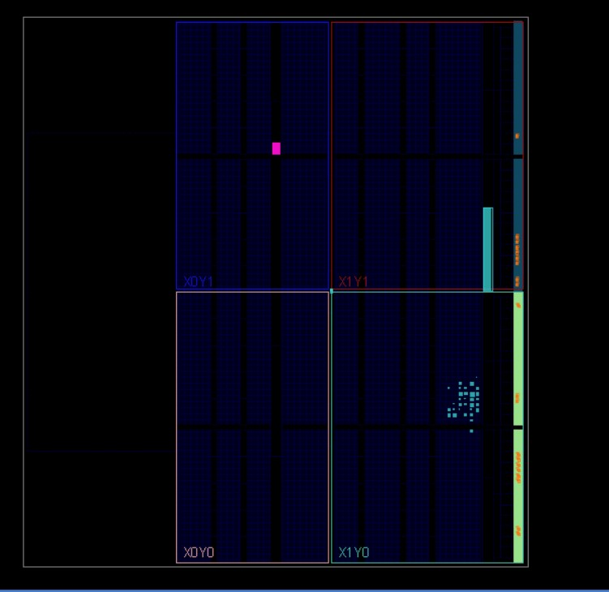

# PRBS with Sequence Detector Implementation
## Table of content
- [PRBS with Sequence Detector Implementation](#prbs-with-sequence-detector-implementation)
  - [Table of content](#table-of-content)
  - [Introduction](#introduction)
  - [RTL Implementation](#rtl-implementation)
    - [PRBS-15 Block](#prbs-15-block)
      - [Simulation Waveform](#simulation-waveform)
    - [Byte Sequence Detector](#byte-sequence-detector)
      - [Simulation Waveform](#simulation-waveform-1)
    - [Top Wrapper](#top-wrapper)
      - [Simulation Waveform](#simulation-waveform-2)
  - [FPGA Implementation](#fpga-implementation)
    - [Block Diagram](#block-diagram)
    - [Design Constrains](#design-constrains)
    - [Design Elaboration](#design-elaboration)
    - [Design Synthesis](#design-synthesis)
    - [Design Implementation and bitstream](#design-implementation-and-bitstream)
  - [Bit Sequence Detector](#bit-sequence-detector)
    - [FPGA Implementation](#fpga-implementation-1)
    - [FPGA LEDS Output](#fpga-leds-output)

## Introduction
The system used in testing the Link Quality between two points, where the Pseudorandom binary sequence **(PRBS-15)** Block takes 4 byte input data and send it-byte by byte-**n** times to the **Byte Sequence Detector** if the Sequence Detector detects the sequence, a flag will be **raised** indicating that the sequence is correct and you may capture the upcoming random data.
The random data is calculated using linear feedback shift register **(LFSR)** by PRBS-15 shifter and xoring the last two bits **(bit 14 and bit 13)**.

## RTL Implementation
### PRBS-15 Block

This Block will take one byte input data with each clock for the first 4 clock cycles, then it will store it in a variable and output each byte of this variable **n times**, then it will continuously send random data using LFSR as mentioned above.

The below figure shows the expected waveform simulation using wavedrom.

note: the assertion of the rst signal and the input happens at the negative edge clk

#### Simulation Waveform
To simulate, We will use a directed TestBench with **n=2** and clk period of **10ns** and the Sequence used is **CCDDEEFF**,
So the PRBS will take the input and ouput it n times then randomize the output 

`PRBS_SHIFTER<={PRBS_SHIFTER[13:0],PRBS_SHIFTER[14]^PRBS_SHIFTER[13]};`

`data_out<={PRBS_SHIFTER[6:0],PRBS_SHIFTER[14]};` 

### Byte Sequence Detector

This Block will take one byte input data with each clock, it uses Finite State Machine **FSM** to check if the inputs is equal to the corresponding byte it will change the state.

 if the data matches the sequence, it will raises a flag indicating that the sequence is correct and you may capture the upcoming random data as mentioned above.

note: the assertion of the rst signal and the input happens at the negative edge clk

#### Simulation Waveform

To simulate, We will use a directed TestBench with **n=2** and clk period of **10ns** and the Sequence used is **CCDDEEFF**,
So the detector will take the input n times and checks if the data is correct if so the data flag is raised.

if the detected data is wrong, the flag will not be raised.

### Top Wrapper
In the top wrapper we connect the two blocks together so the output of the PRBS-15 will be the input of the detector.

note: the assertion of the rst signal and the input happens at the negative edge clk

#### Simulation Waveform

To simulate, We will use a directed TestBench with **n=2** and clk period of **10ns** and the Sequence used is **CCDDEEFF**,
So the PRBS will take the input and ouput it n times then randomize the output meanwhile the detector will take the input n times and checks if the data is correct if so the data flag is raised .

## FPGA Implementation
### Block Diagram
The design will be used on **Zybo z7 FPGA kit** provided by **digilent.inc**.
The design uses the FPGA system clock and divides it to the operation CLK, which will be 200 ns (**frequency = 5 MHZ**)

### Design Constrains
Then it is required to write all the constrains to enable the bitstream to be generated

### Design Elaboration
After setting the block diagram and the constrains file, It is required to run Elaboration, this will generate the elaboration block diagram.

### Design Synthesis 
Then running Synthesis will generate utilization and power summaries

Note: **This power Summary is a statistical power summary no SAIF file used**

### Design Implementation and bitstream

Now the design is ready for implementation (placement and route) which will place the components on the FPGA, Then the final step is to Generate the bit stream.

## Bit Sequence Detector
Another way to implement sequence detector is to make it Bit sequence Detector this will increase the design Complexity but will enable the data overlapping if a long stream of data is sent.The sequence used is **CCDDEEFF**

Note: **This Diagram doesn't contain the overlapping conditions if needed check the RTL** 

The detector will take the input sequence n times then the stream of data, this will not suit the PRBS-15 as the PRBS takes the input only one time at the start of the sending.but This detector can be used in protocols that requires a certian sequence at the beginning.

The PRBS-15 is the same as mentioned above with just changing the output to be serial output instead of one byte.

### FPGA Implementation
The FPGA steps are the same, But here some optimization happened to enable us to see the result on the **ZYBO Z7 FPGA**, where now the **(DATA_IN, n)** are **parameterized** and **Done_value is shown on the leds** of the FPGA

 Where if the data sequence is right, the fpga will **output the value 5 (4'b0101)** while if the data is wrong, **output the value 10 (4'b1010)**, Also the clk period used is 10 ns **(Frequency = 100MHz)**

 ### FPGA LEDS Output
 The data sent is the same used in the [Top Wrapper](#top-wrapper), So now the FPGA should output the value 5 on the LEDS,

In case of Wrong Sequence the FPGA will output the value 10 on the LEDS.

**Wrong sequence used is CCDDAAFF**

